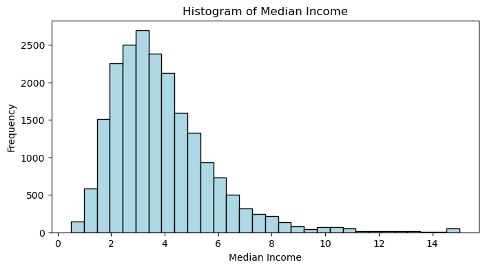
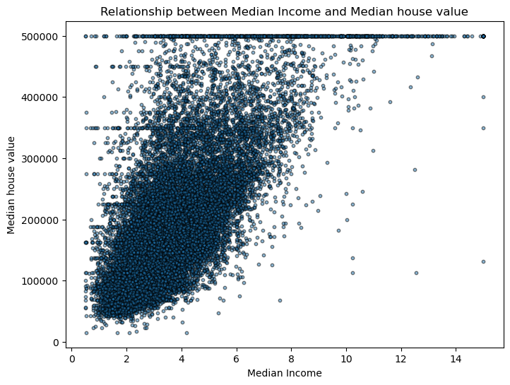
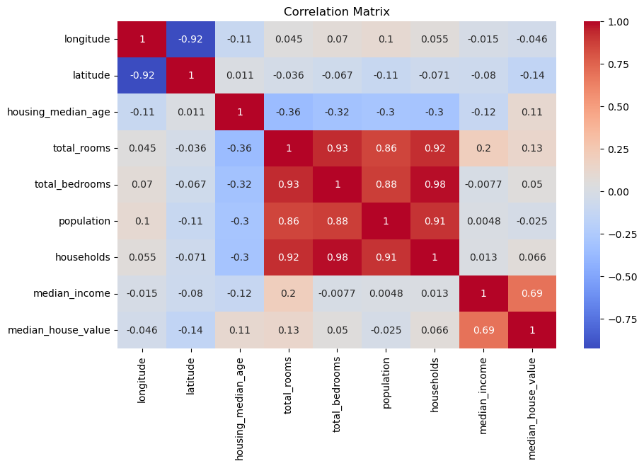

# California Housing Price Analysis (EDA)

## 📌 Project Overview
This project performs Exploratory Data Analysis (EDA) on the California Housing dataset to identify key factors influencing housing prices. The analysis includes data cleaning, visualization, and feature engineering to extract meaningful insights.

---

## 🎯 Objectives
- Understand the distribution of key variables  
- Handle missing values  
- Analyze relationships between features  
- Perform feature engineering  
- Identify factors affecting house prices  

---

## 📊 Dataset Description
The dataset contains demographic, geographic, and housing-related features:

- median_income: Income level of households  
- housing_median_age: Age of houses  
- total_rooms, total_bedrooms: Housing structure  
- population, households: Demographics  
- latitude & longitude: Location  
- ocean_proximity: Distance from ocean  
- median_house_value: Target variable  

---

## 🔍 Key Analysis Performed
- Distribution analysis using histograms  
- Relationship analysis using scatter plots  
- Handling missing values  
- Feature engineering  
- Correlation analysis using heatmap  
- Outlier detection using boxplots  

---

## 📈 Key Insights
- Median income is the strongest predictor of house prices  
- Higher income areas have higher housing prices  
- Dataset contains capped values (house price & housing age)  
- Coastal regions show higher population density and income  
- Presence of outliers and skewed distributions  

---

## 📊 Visualizations

---

## 🛠️ Tools & Technologies
- Python  
- Pandas  
- Matplotlib  
- Seaborn  

---

## 📌 Conclusion

The exploratory data analysis reveals that median income and geographic location are the most significant factors influencing housing prices in California. A strong positive relationship exists between income and house value, indicating that higher-income areas tend to have more expensive housing.

The analysis also highlights important dataset characteristics, such as capped values for house prices and housing age, as well as skewed distributions and the presence of outliers. Additionally, coastal regions exhibit higher population density and housing demand compared to inland areas.

Overall, the project demonstrates how data cleaning, visualization, and feature engineering can be used to extract meaningful insights and better understand real-world datasets.

---

## 📂 How to Run
1. Clone the repository  
2. Open the notebook in Jupyter  
3. Run all cells  

---

## 👤 Author
Sababa Usmani
